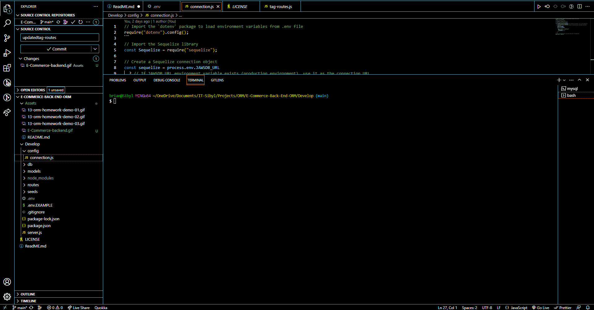

## 🛒 E-Commerce-Back-End


[](https://www.npmjs.com/)
[](https://www.npmjs.com/package/mysql2)
[](https://sequelize.org/)
[](https://www.npmjs.com/package/dotenv)
[](https://www.heroku.com/)
    
## 📄 Description 
Back end for my e-commerce website that uses Express.js and Sequelize to interact with a MySQL database. 

## 🪛 Technologies used 
<p><a href="https://nodejs.org/">Node.js</a></p>
<p><a href="https://www.npmjs.com/">NPM</a></p>
<p><a href="https://www.npmjs.com/package/express">Express.js</a></p>
<p><a href="https://www.npmjs.com/package/mysql2">MySQL2</a></p>
<p><a href="https://www.npmjs.com/package/sequelize">Sequelize</a></p>
<p><a href="https://www.npmjs.com/package/dotenv">dotenv</a></p>
<p><a href="https://heroku.com/">Heroku</a></p>
  
## 📓 Table of Contents
* [Installation](#🖥️-installation)
* [Usage](#💬-usage)
* [Screenshot](#🖼️-screenshot)
* [Screencastify](#📹-screencastify)
* [License](#⚖️-license)
* [Contributing](#🤝-contributing)
* [Questions](#❔-questions)
    
## 🖥️ Installation 
To install all necessary dependencies. Please run the following command in your terminal:

```
npm install
```

Also, ensure that you have created a .env file where you type in the database name (employee_db), your username and password for your mysql account.

From the root level of the project, run:

```
mysql -u root p
```

Enter your username and password. Then, you will run the database by typing the following in the command line:

```
SOURCE db/schema.sql;
```
Don't forget to seed your database in the terminal with:

```
node seeds
```

Once the databse has been populated, you can now run the server.

```
npm start

```
(which runs server.js)
  
## 💬 Usage 
Users can view backend e-commerce data using Insommnia to make HTTP GET, POST, PUT and Delete requests to the e-commerce.db


## 🖼️ Screenshot
Post request of Products in Insommnia


Gif showing GET POST PUT and DELETE for Tags


## 📹 Screencastify 
https://drive.google.com/file/d/13aAsAFSRms9HSdej-1iIB35jPy7bkXxi/view
  
## ⚖️ License 
This project is licensed under MIT
  
## 🤝 Contributing 
Brian Trang
with thanks to USYD
   
## ❔ Questions
If you have any questions about this project, please contact me directly at brian.trang9@gmail.com. Feel free to view more of my projects at https://github.com/MakeRedundant.